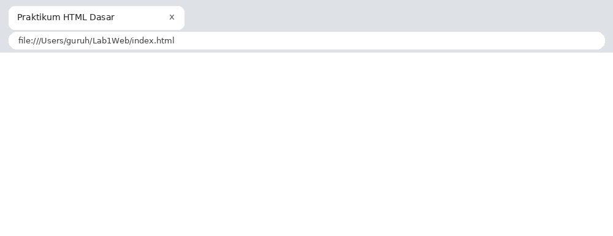
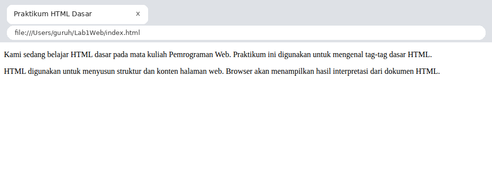
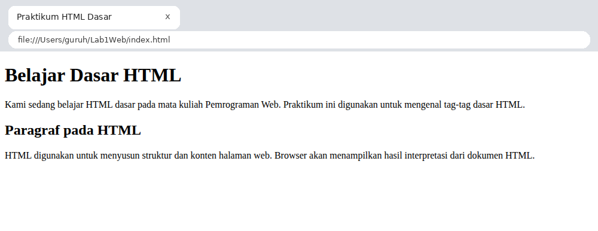
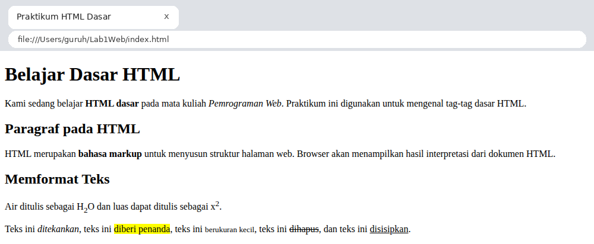
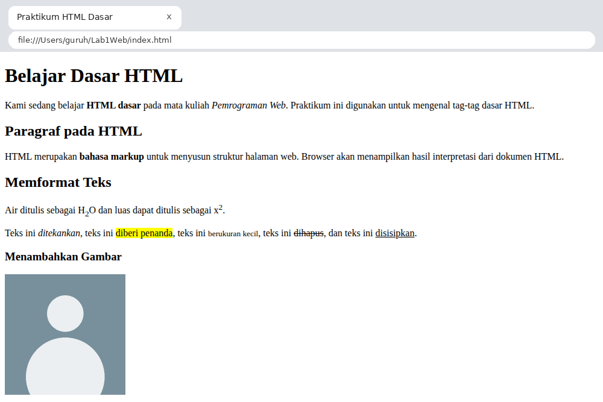
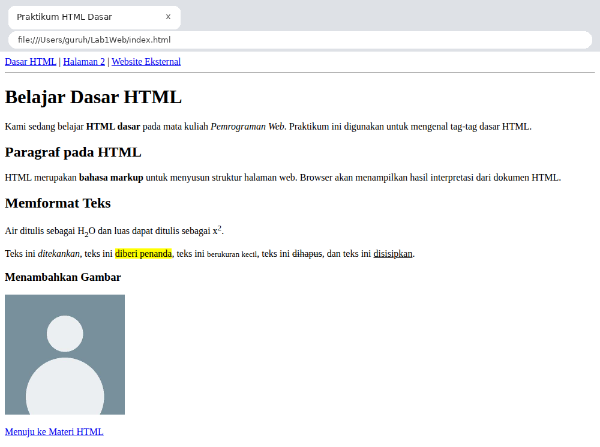
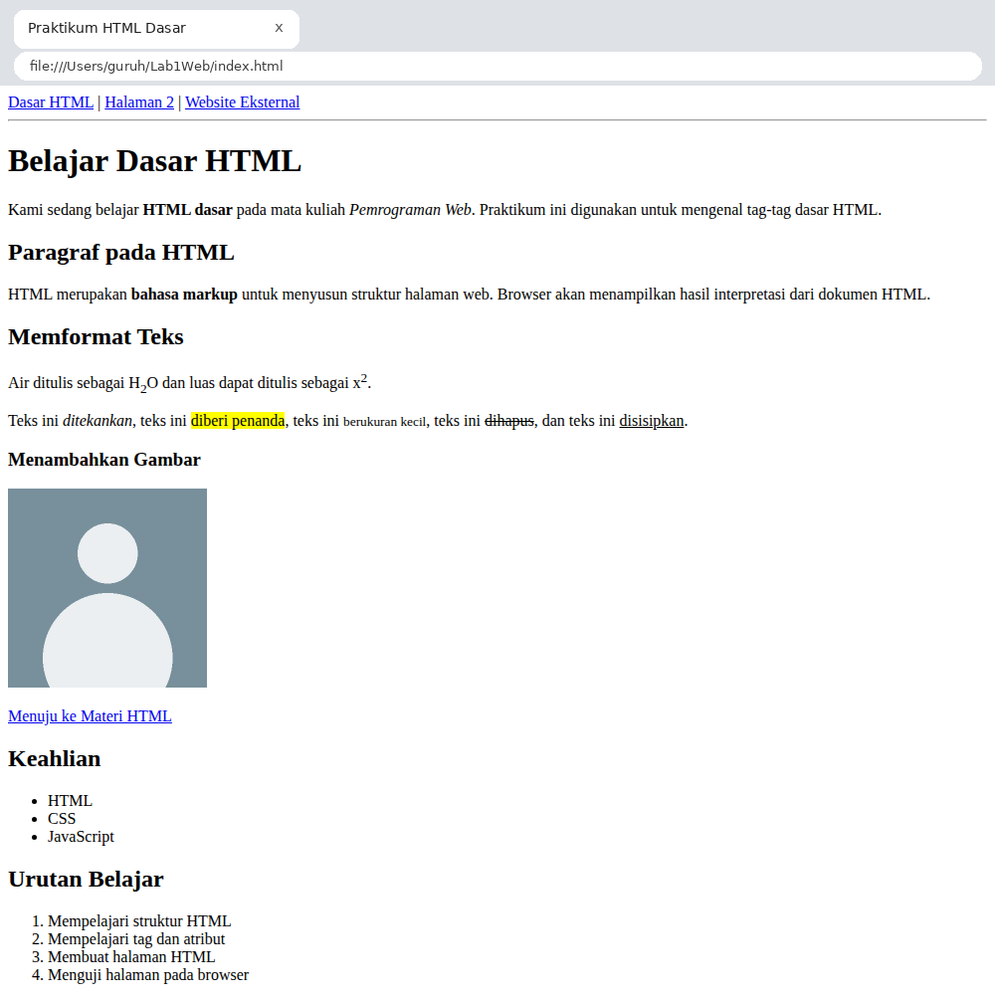
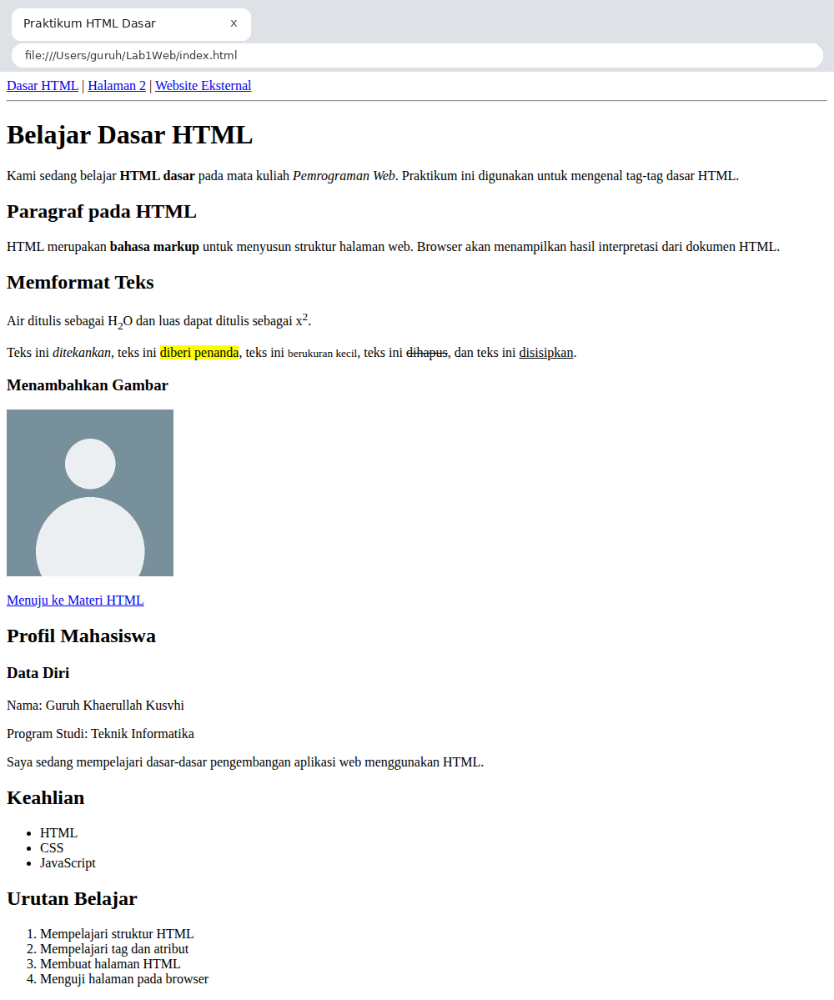
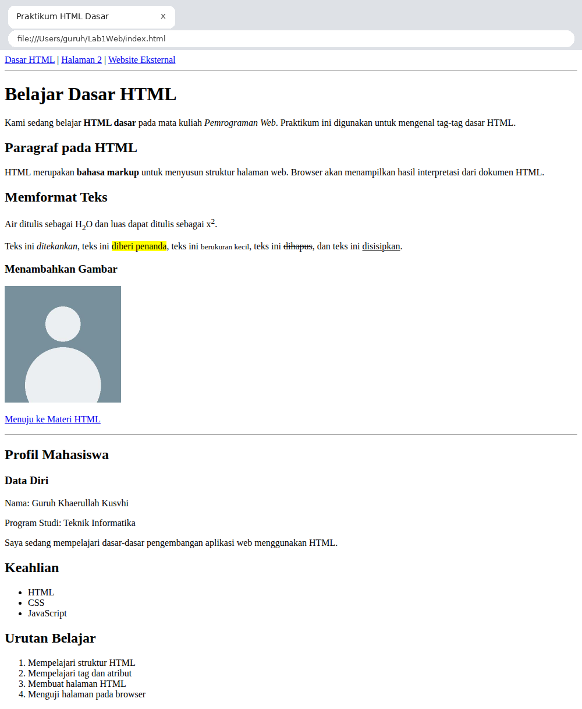
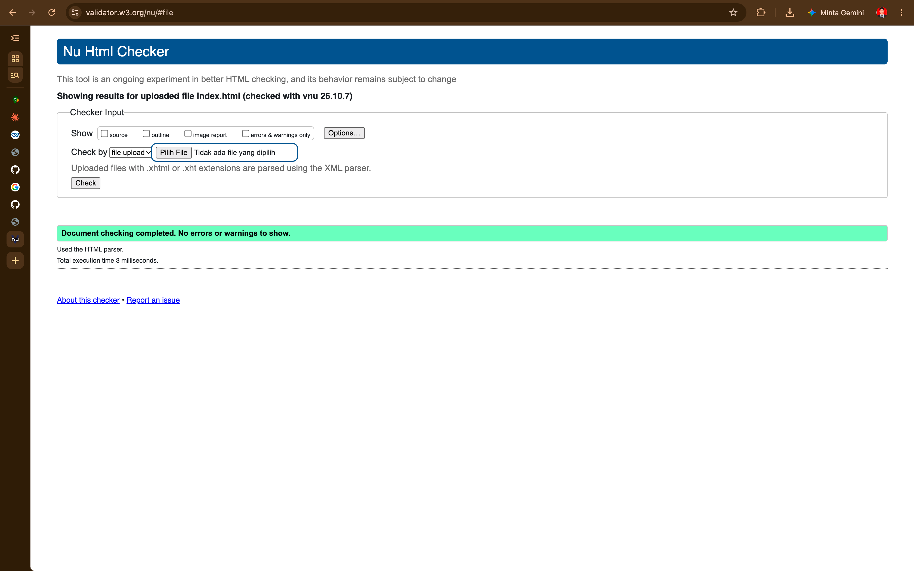

# Lab1Web – Praktikum 1 HTML Dasar

**Nama:** Guruh Khaerullah Kusvhi
**NIM:** 312310630
**Kelas:** I231C – Teknik Informatika

## Struktur Repository

```
Lab1Web/
├── index.html
├── halaman2.html
├── images/
│   └── profil.jpg
├── screenshots/
└── README.md
```

## Langkah Praktikum

### 1. Persiapan dan struktur dasar HTML
Membuat folder kerja, lalu file `index.html` berisi struktur dasar: `<!DOCTYPE html>`, `<html>`, `<head>` dengan `<title>`, dan `<body>`. Hasilnya, judul tab browser tampil "Praktikum HTML Dasar" sedangkan halaman masih kosong.



### 2. Membuat paragraf
Menambahkan dua paragraf dengan tag `<p>`. Browser menampilkan jarak otomatis antar paragraf.



### 3. Menambahkan judul
Menambahkan `<h1>` sebagai judul utama dan `<h2>` sebagai subjudul sebelum paragraf kedua.



### 4. Memformat teks
Mencoba tag `<b>`, `<i>`, `<strong>`, `<sub>`, `<sup>`, serta `<em>`, `<mark>`, `<small>`, `<del>`, dan `<ins>`.



### 5. Menyisipkan dan mengatur ukuran gambar
Menyimpan foto di folder `images/` lalu menampilkannya dengan `` memakai atribut `src`, `width`, `alt`, dan `title`. Ukuran diatur lewat `width="200"`.



### 6. Menambahkan hyperlink
Membuat `halaman2.html`, lalu menambahkan menu navigasi di kedua halaman: link internal (`index.html`, `halaman2.html`) dan link eksternal (`https://www.google.com`). Juga mencoba anchor `#materi` untuk pindah ke bagian lain di halaman yang sama.



### 7. Menambahkan list
Membuat daftar keahlian dengan `<ul>` (bullet) dan urutan belajar dengan `<ol>` (bernomor).



### 8. Menambahkan komentar
Menambahkan komentar `<!-- ... -->` sebagai penanda tiap bagian kode. Komentar tidak tampil di browser.



### 9. Menggabungkan semua elemen
Menyusun halaman Profil Mahasiswa dari seluruh elemen yang sudah dipelajari.



### 10. Validasi HTML
Memeriksa struktur HTML di https://validator.w3.org.



---

## Jawaban Pertanyaan

**1. Apa fungsi deklarasi `<!DOCTYPE html>` pada dokumen HTML?**
Memberi tahu browser bahwa dokumen ditulis dengan HTML5, sehingga halaman dirender dalam *standards mode*. Tanpa deklarasi ini, browser bisa masuk *quirks mode* dan tampilan menjadi tidak konsisten.

**2. Apa perbedaan antara tag, elemen, dan atribut pada HTML?**
- **Tag**: penanda yang ditulis dalam kurung sudut, misalnya `<p>` dan `</p>`.
- **Elemen**: kesatuan lengkap, yaitu tag pembuka + isi + tag penutup, misalnya `<p>Halo</p>`.
- **Atribut**: informasi tambahan di dalam tag pembuka dengan format `nama="nilai"`, misalnya `href="kontak.html"` pada `<a>`.

**3. Apa perbedaan `<p>` dengan `<br>`? Jelaskan penggunaannya.**
`<p>` membuat satu paragraf utuh, bersifat *block* dan otomatis diberi jarak atas-bawah. `<br>` hanya memindahkan teks ke baris baru di dalam paragraf yang sama, tidak punya isi dan tidak punya tag penutup. Pakai `<p>` untuk memisahkan paragraf, dan `<br>` untuk pindah baris di tengah teks, misalnya penulisan alamat atau bait puisi.

**4. Apa fungsi atribut `href` pada tag `<a>`?**
Menentukan alamat tujuan hyperlink, berupa URL atau path file, yang dibuka ketika link diklik.

**5. Apa perbedaan hyperlink ke halaman internal dengan hyperlink ke website eksternal?**
Link internal mengarah ke halaman dalam website sendiri dan cukup memakai path relatif, contoh `<a href="profil.html">`. Link eksternal mengarah ke website lain dan memakai URL lengkap, contoh `<a href="https://www.example.com">`. Link eksternal sering ditambah `target="_blank"` agar terbuka di tab baru.

**6. Apa fungsi atribut `src` dan `alt` pada tag ``?**
- `src` menunjukkan lokasi file gambar yang akan ditampilkan.
- `alt` berisi teks pengganti yang muncul jika gambar gagal dimuat, dibacakan oleh *screen reader* untuk pengguna tunanetra, dan membantu SEO.

**7. Apa perbedaan penggunaan `<ul>` dan `<ol>`?**
`<ul>` (*unordered list*) menampilkan daftar dengan bullet untuk item yang urutannya tidak penting. `<ol>` (*ordered list*) menampilkan daftar bernomor untuk item yang urutannya penting, seperti langkah-langkah. Keduanya memakai `<li>` untuk setiap item.

**8. Apa yang terjadi jika path gambar pada atribut `src` salah?**
Gambar tidak tampil. Browser menampilkan ikon gambar rusak, beserta teks `alt` jika ada. Path yang salah bisa karena nama file keliru, ekstensi berbeda, huruf besar-kecil tidak cocok, atau folder tidak sesuai.

**9. Mengapa struktur heading `h1` sampai `h6` perlu digunakan secara terstruktur?**
Heading membentuk hierarki isi halaman. Struktur yang rapi memudahkan pembaca memahami isi, membantu *screen reader* menavigasi halaman, dan membantu mesin pencari memahami topik utama. Gunakan satu `h1` sebagai judul utama dan jangan melompati level (misalnya dari `h1` langsung ke `h4`). Pilih heading berdasarkan makna, bukan karena ukuran hurufnya.

**10. Apa fungsi komentar `<!-- ... -->` dalam kode HTML?**
Menulis catatan di dalam kode yang tidak ditampilkan di browser. Berguna untuk menjelaskan bagian kode kepada developer lain atau diri sendiri, dan untuk menonaktifkan sementara sebagian kode tanpa menghapusnya.
